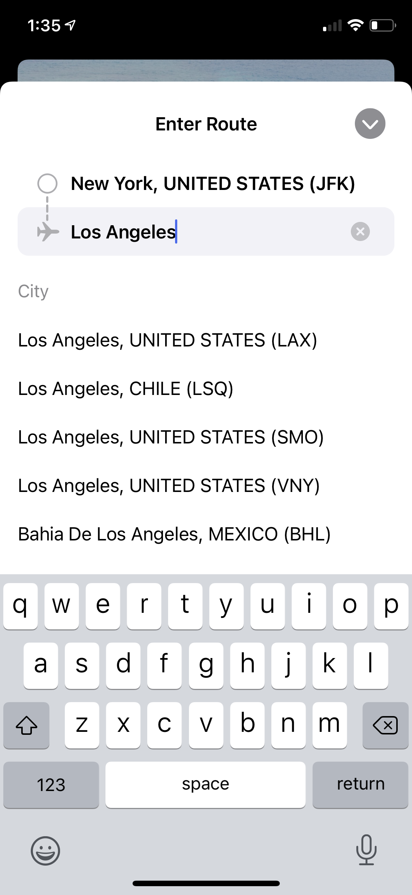
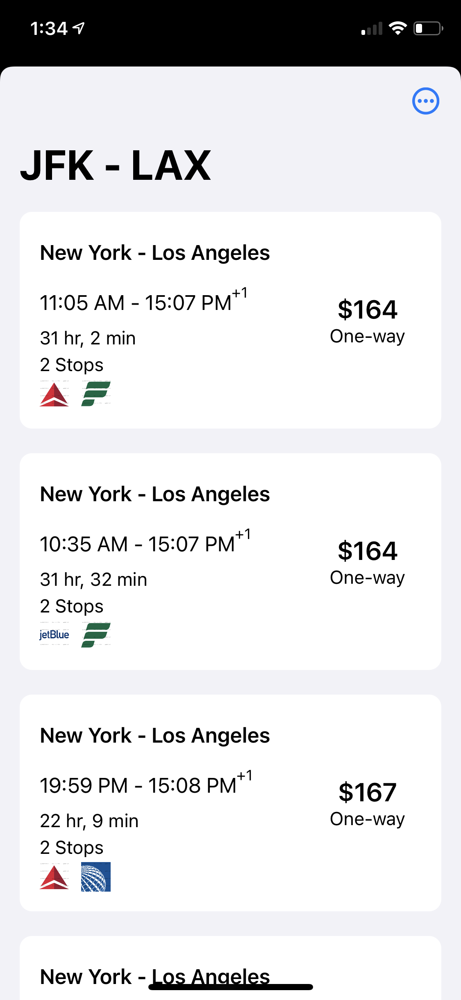
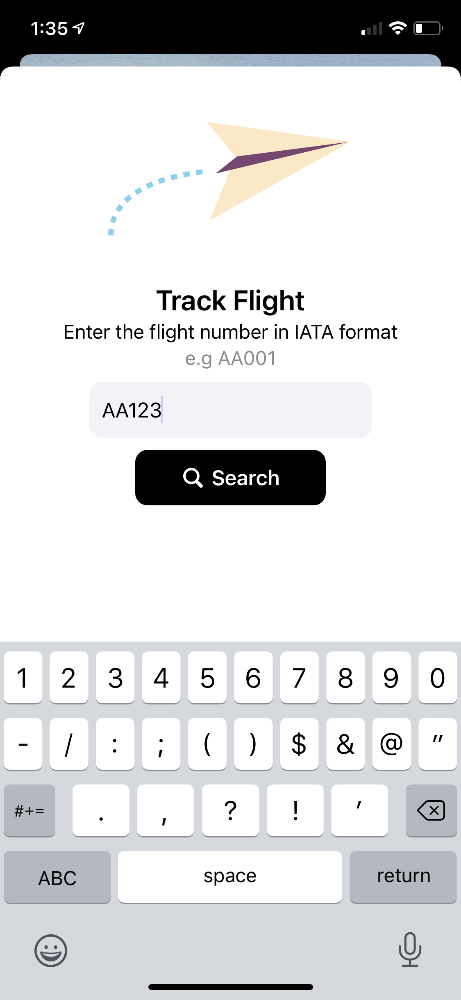
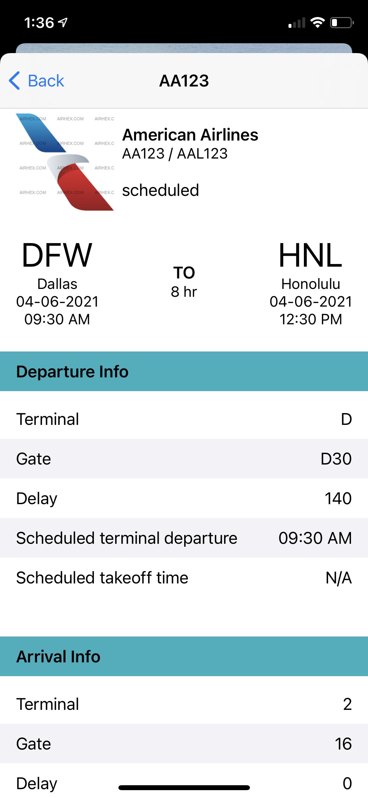

# RichFlights-2.0
Flight ticket price and progress tracking

## Motivation
This project is an update for a class project I did back in college ([original college project repo](https://github.com/masterstoney/richsflights)). I wanted to see what the project would be like in a world where SwiftUI, Combine and Widgets exist. Admittedly, I only ended up using SwiftUI for a widget view and a single detailed view (my love for UIKit is still very strong). I also wanted to add a feature to track the progress of flights which is a feature that was not available in the original application.

## Screenshots

  
  
  
  
  
  
  

